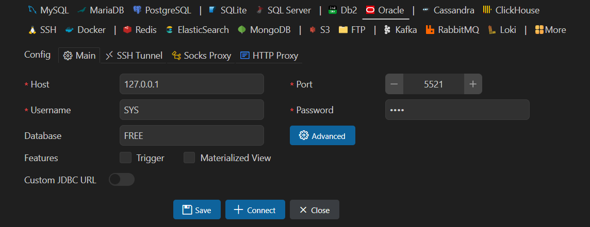
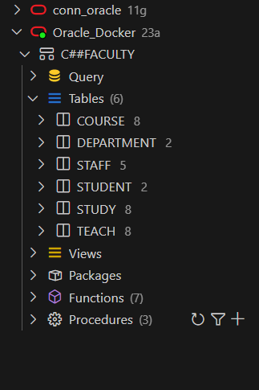

This project aims to design and implement a robust Data Management System for a university, leveraging SQL, PLSQL, Advanced PLSQL, Red Hat, and Bash scripting. The system is designed to manage various aspects of university operations, including student records, course management, department administration, and academic performance tracking. 

# Overview

The system is built around a relational database schema that includes tables for students, courses, departments, and grades. The schema is normalized to ensure data integrity and efficiency. Key features of the system include:

Student Management: Track student information, including personal details, academic progress, and supervisor assignments.

Course Management: Manage course details, enrollment status, and teaching staff assignments.

Department Management: Handle department information, including staff assignments and department managers.

Grade Calculation: Automatically calculate student grades and GPA based on course performance.

Automation: Implement automated backup and monitoring scripts to ensure database reliability and performance.

# Database Design

## Entity-Relationship Diagram (ERD)

## Design takeaways

- Student may have a supervisor from the teaching staff.
- Academic level is calculated based on completed hours.
- Department may be managed by a staff member and not every staff member is a department manager.
- Staff member may work in a department, the Dean works in the 'Dean' department which he/she also manages.
- Departments must have students enrolled, Not all students enroll in departments.
- Not all courses are taught by staff members, and not all staff members teach courses.
- The status (active/inactive) of the course is determined by how many students registered the course. Not less than 15.
- Student grades are deleted when deleting student data.
- We can't delete a course that students took (have grades for), but these course can be set to be inactive.
- Max score for each course is 100.
- Grade of the student is calculated upon graduation for the student based on CGPA.

------------------------------------------------------------------------

The ERD represents the following entities and their relationships:

- **Student**
- **Course**
- **Staff**
- **Department**
- **Teach**
- **Study**

## Schema Tables

\### 1. Student

- **Columns**
  - **Student ID (PK)**: Unique identifier for each student.
  - **National ID**: Official identification number. **(Unique, not null)**
  - **First Name**: Student's first name. **(Not null)**
  - **Last Name**: Student's last name. **(Not null)**
  - **Gender**: Gender of the student. **Check ('M' or 'F')**
  - **Birth Date**: Date of birth.
  - **Email:** Academic email of the student. **(Unique, Not null, Check (Like '%@%.com'))**
  - **Phone:** Phone number of the student.
  - **Enrollment Date:** Date of enrollment into the faculty. **(Not null)**
  - **Completed Hours**: Total credit hours completed. **(Not null)**
  - **CGPA**: Cumulative Grade Point Average. **(Not null)**
  - **Supervisor ID (FK):** Reference to the supervising staff member. **(Not null)**
  - **Department ID (FK)**: Reference to the department the staff belongs to.

### 2. Course

- **Columns:**
  - **Course ID (PK)**: Unique identifier for each course.
  - **Course Name**: Name of the course. **(Unique, Not null)**
  - **Credit Hours**: Number of credit hours for the course. **(Not null)**
  - **No. of Students**: Total number of students enrolled in the course. **(Not null)**
  - **Status**: Current status of the course (active/inactive). **(Not null)**

### 3. Staff

- **Columns:**
  - **Staff ID (PK)**: Unique identifier for each staff member.
  - **National ID**: Official identification number. **(Unique, Not null)**
  - **First Name**: Staff member's first name. **(Not null)**
  - **Last Name**: Staff member's last name. **(Not null)**
  - **Hire Date:** The date a staff member was hired. **(Not null)**
  - **Role**: Job title or position. **(Not null)**
  - **Department ID (FK)**: Reference to the department the staff belongs to. **(Not null)**

### 4. Department

- **Columns:**
  - **Department ID (PK)**: Unique identifier for each department.
  - **Department Name**: Name of the department. **(Unique, not null)**
  - **Manager ID (FK)**: Reference to the staff member managing the department. **(Not null)**

### 5. Study (Student-Course Relationship)

- **Columns**:
  - **Student ID (PK, FK)**: Reference to the student who has registered the course.
  - **Course ID (PK, FK)**: Reference to the course the student registered.
  - **Semester:** The semester in which the student registered the course, eg. Spring. **(PK)**
  - **Year:** The academic year, eg. 2024 . **(PK)**
  - **Score:** The score of the student in each course. **(Not null)**

### 6. Teach (Staff-Course Relationship)

- **Columns**:
  - **Staff ID (PK, FK)**: Reference to the staff member who is teaching the course.
  - **Course ID (PK, FK)**: Reference for the course taught by the staff member.

# Database installation on docker

In this tutorial we will go step by step how to install oracle database inside docker container.

Tools we will use:
[Dokcer desktop application](https://www.docker.com/get-started/)
[VScode](https://code.visualstudio.com/download)

Here we go:

To create oracle container, run inside powershell or your terminal, ORACLE_PWD is the password, <path_inside_your_machine> replace with the place you want to mount inside the container.

In my case oracle database was installed on my machine so port 1521 was already taken on the host, hence used port 5521.

for more config options, please check [Custom Configuration Parameters for Oracle Database on Docker](https://docs.oracle.com/en/database/oracle/oracle-database/21/deeck/index.html#GUID-6F97BC9A-15E5-4D59-B293-99D8605D9C85)

    docker run --name oracle_db -p 5521:1521 -e ORACLE_PWD=1234 -v <path_inside_your_machine>:/opt/oracle/oradata container-registry.oracle.com/database/free:latest -e ENABLE_ARCHIVELOG=true

Once the container is running, open vscode and install Database Client JDBC extension

Once the extension is installed, Go to the database icon and create new connection, this should be your configs, don't forget connection name

**If the connection failed try to open the container and run sqlplus then create new schema/user and try to connect with the new user and password**

Once the connection is established you should see this view

- Now we can run sql statements to create tables and insert into tables, or run plsql block by choosing execute without parsing, All files are included in physical schema folder.

- We need to create scripts to automate backup and monitor database:

Go to the container and run the following:

    yum update && yum install cronie

this will give an error, to fix it delete the specified line in this issue:
https://github.com/oracle/docker-images/issues/2900

now try to run the command again.

to make sure cron is running:

    /usr/sbin/crond

# Automated database backup and monitor scripts

Using shell scripting, we can schedule the export backup as per our convenient time. Using the following steps we can schedule expdp backup.

- Create a directory at OS level.

OS level directory called physical directory, we will use /opt/oracle/oradata/exports as the physical directory
and store our scripts in /scripts directory.

`$mkdir /scripts`

- Create directory at the Database level.

Database level directory called logical directory.

\`\$sqlplus <user>/<password>@//<IP>/<Instance_name> as sysdba

`SQL> create directory EXP_DUMP as '/opt/oracle/oradata/exports';`

- Check directory information at the Database level.

`SQL> select * from dba_directories;`

- Create Schema

To execute the export backup we need a dedicated schema to run the database backup. We also run the backup as an SYS user.

    SQL> create user master
             identified by master
            default tablespace users
            quota unlimited on users
            account unlock;

- we need to grant the required permissions to the master user. Use the below commands to grant permissions.

<!-- -->

    SQL> grant read, write on directory EXP_DUMP to master;

    Grant succeeded.

    SQL> grant exp_full_database, imp_full_database to master

    Grant succeeded.

- It's time to prepare the shell script and grant 775 permission to shell script. See the script in export_bkp.sh

`$chmod 775 /scripts/export_bkp.sh`

- This is the final step, here we are going to make it automatic with the help of the crontab scheduler.

Open crontab and add the below entry inside.

`$crontab -e`

Make sure you are specifying time according to the container time --\> use command `date` to get current date and time inside the container.

`30 19 * * * /scripts/export_bkp.sh`

Make sure backup files are created in /opt/oracle/oradata/exports

for troubleshooting try to run the expdb command alone, try to run the script for example run /path_to_your_script/your_script.sh, and try to run it in contab

- Now we can create monitoring script to monitor database and disk usage, we create the script inside scripts directory and grant 775 permissions.

`chmod 775 /scripts/monitor_db.sh`
